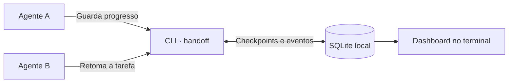

# Handoff

Continua uma tarefa com outro agente, sem explicar tudo de novo.



O agente guarda o que fez, onde parou e a próxima ação. O seguinte recebe o último
checkpoint e as novidades posteriores. Tudo fica em `~/.handoff/handoff.db`,
sem servidor nem configuração MCP.

## Usar

```sh
conda activate dev
pip install -e .
handoff
```

O agente só precisa de acesso ao terminal e ao comando:

> Executa `handoff guide` e usa o handoff para guardar o progresso desta tarefa.

Noutra sessão, com acesso ao mesmo projeto:

> Continua a thread `<id>` do handoff. Usa `handoff resume <id>`.

```sh
handoff start "Corrigir sessões" --objective "Rejeitar sessões expiradas"
handoff record <id> "Causa identificada"
handoff checkpoint <id> --file checkpoint.json
handoff resume <id>
```

`handoff guide` mostra o formato do checkpoint. `handoff --help` lista os comandos.
Se o ambiente não estiver ativo, o agente pode usar `conda run -n dev handoff ...`.

## No terminal

Exemplo com duas threads:

```text
HANDOFF
Em curso: 1 | Bloqueada: 0 | Concluída: 1
────────────────────────────────────────────────────────
1 Em curso Corrigir expiração de sessões
     7c912be805cf4bd4a8362bd6fc8f0f21
2 Concluída Adicionar testes de autenticação
     d042ae3d60f84dfe8f2daa4d18f126a9

Número: abrir | Enter: atualizar | q: sair >
```

Abre uma thread pelo número para ver o progresso, os bloqueios e a próxima ação.
