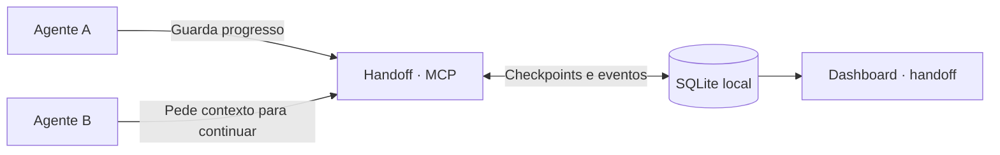

# Handoff

Continua uma tarefa com outro agente, sem explicar tudo de novo.



O agente guarda o que fez, onde parou e a próxima ação. O seguinte recebe o último
checkpoint e as novidades posteriores; consulta evidências quando precisa.
Tudo fica em `~/.handoff/handoff.db`.

## Usar

```sh
conda activate dev
pip install -e .
handoff
```

Adicionar ao cliente MCP (formato `mcpServers`):

```json
{
  "mcpServers": {
    "handoff": {
      "command": "conda",
      "args": ["run", "--no-capture-output", "-n", "dev", "python", "-m", "handoff.server"]
    }
  }
}
```

Na primeira sessão: **“Usa o handoff para guardar o progresso desta tarefa.”**
Na seguinte, com acesso ao mesmo projeto: **“Continua a thread `<id>` do handoff.”**

## No terminal

Exemplo com duas threads:

```text
HANDOFF
Em curso: 1 | Bloqueada: 0 | Concluída: 1
────────────────────────────────────────────────────────
1 Em curso Corrigir expiração de sessões
     7c912be805cf4bd4a8362bd6fc8f0f21
2 Concluída Adicionar testes de autenticação
     d042ae3d60f84dfe8f2daa4d18f126a9

Base de dados: /Users/tu/.handoff/handoff.db

Número: abrir | Enter: atualizar | q: sair >
```

Abre uma thread pelo número para ver o progresso, os bloqueios e a próxima ação.
